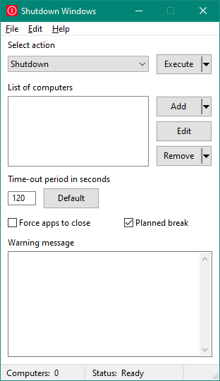

# Shutdown
The *Shutdown* app is an graphical app that written in *C++* with using *WinAPI* and allows to shut down a local host or remote ones. For details, see [Wiki](https://github.com/DP458/Shutdown/wiki).

## Building
There are 2 variants:
- Open [Shutdown.sln](./src/Shutdown.sln) in *Visual Studio* to compile `Shutdown` project in solution;
- Using scripts in [scripts\build](./scripts/build/) to build and [scripts\test](./scripts/test/) to run.

The [Shutdown.vcxproj](./src/Shutdown/Shutdown.vcxproj) is compatible with *MS Visual Studio 2015*. For building the *Shutdown* on *Windows 10* is needed to be installed the *Windows SDK* version 8.1. Also for building the app is needed to be installed the *Platform Toolset v140*.

## Installer
The *Installer* is created by using *Inno Setup*. Source code of the installer is located in [src\Shutdown_Installer](./src/Shutdown_Installer) and contained in 3 scripts:
1. [Shutdown-x64.iss](./src/Shutdown_Installer/Shutdown-x64.iss) for building the installer for *x64*;
2. [Shutdown-x86.iss](./src/Shutdown_Installer/Shutdown-x86.iss) for building the installer for *x86*;
3. [Shutdown.iss](./src/Shutdown_Installer/Shutdown.iss) has sharred source code for both versions of the installer under *x64* and *x86*.

Compiled executables is saved inside [Shutdown_Installer](./src/Shutdown_Installer) in `bin` folder that is needed to be created there before start a compiling.
